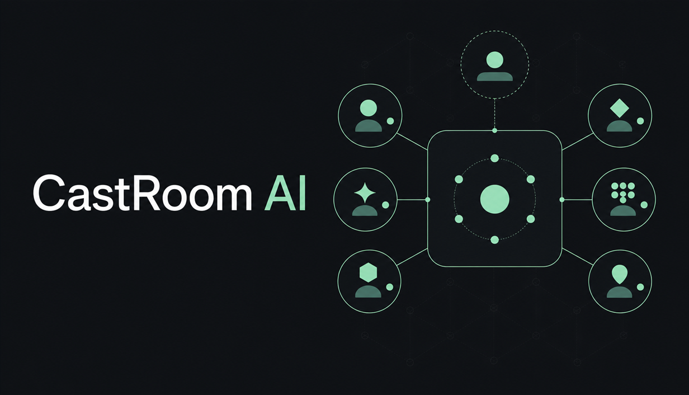
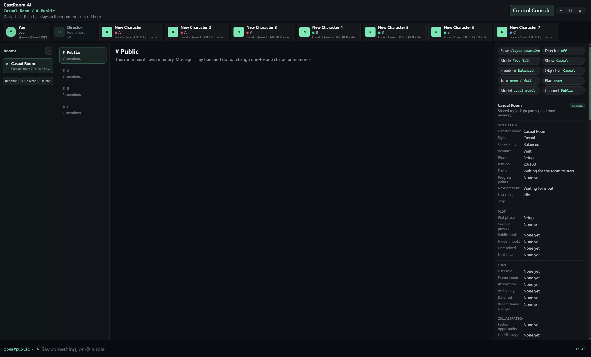
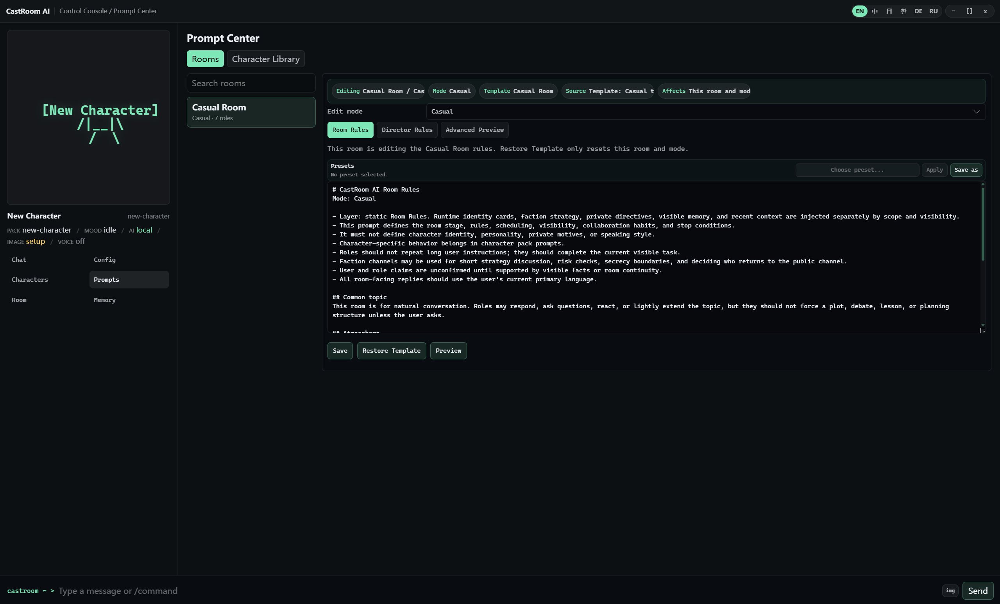
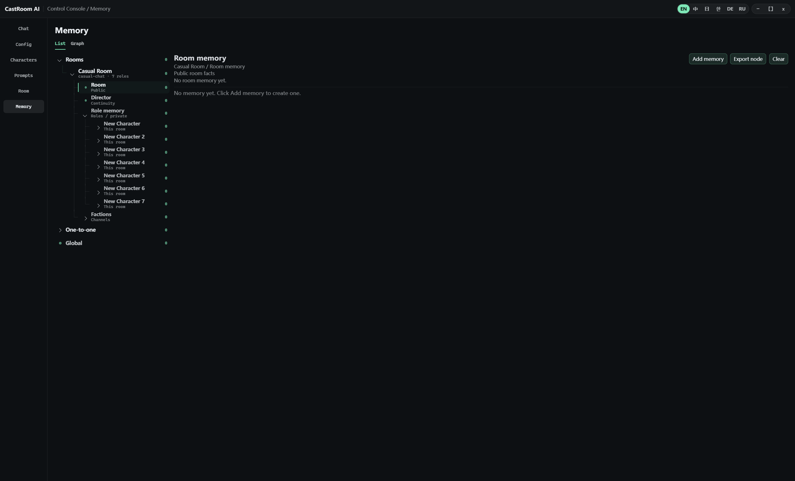
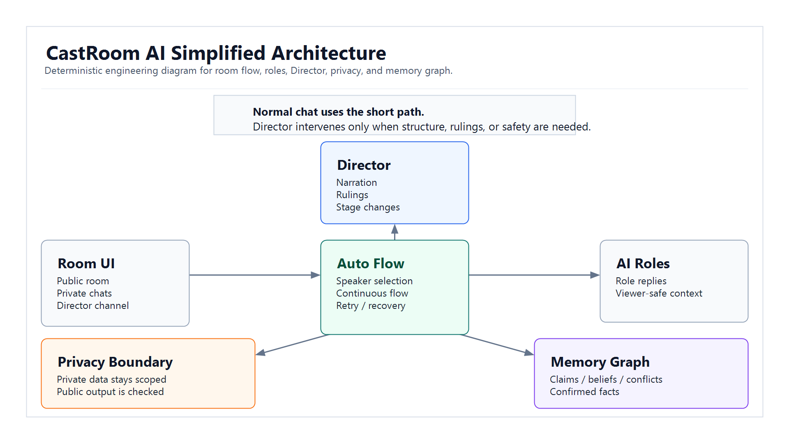
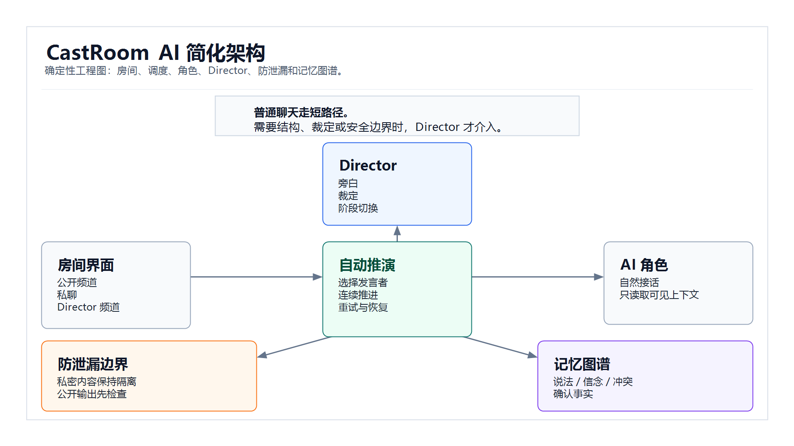

# CastRoom AI



[](https://github.com/98k4jd2qgt-ship-it/CastRoom-AI/releases/latest)
[](#requirements)
[](LICENSE)
[](#status)

CastRoom AI is a Windows desktop app for Director-driven AI room simulation: multiple characters share a room, the scene can keep moving automatically, and memory is tracked as claims, beliefs, confidence, conflicts, and confirmed facts.

CastRoom AI 是一个用于自动化 AI 房间推演的 Windows 桌面应用：多个角色共享一个房间，场景可以自动继续推进，记忆会按说法、信念、置信度、冲突和确认事实来治理。

Download: [Latest release](https://github.com/98k4jd2qgt-ship-it/CastRoom-AI/releases/latest)  
Feedback: [GitHub Issues](https://github.com/98k4jd2qgt-ship-it/CastRoom-AI/issues)  
AI service notes: [Support page](https://98k4jd2qgt-ship-it.github.io/castroom-ai-support/#ai-services)

## What Makes It Different

| Common tool shape | CastRoom AI focuses on |
| --- | --- |
| Multi-character chat | Automated room flow with speaker selection, pacing, and optional Director intervention. |
| Turn-by-turn bot replies | Characters can speak, wait, listen, argue, or be pulled in by room flow. |
| Plain group chat | Public, private, faction, and Director channels have separate visibility boundaries. |
| Flat memory list | Multi-perspective memory with confidence, claims, beliefs, conflicts, and confirmed facts. |
| Manual scenario notes | A room-and-mode scoped Director Script can track hidden facts, public threads, planned beats, and continuity. |
| Hosted character service | Windows desktop app; users configure their own external AI endpoint when needed. |

| 常见形态 | CastRoom AI 的重点 |
| --- | --- |
| 多角色聊天 | 自动房间推演：选择发言者、控制节奏，并在需要时让 Director 介入。 |
| 轮流回复 | 角色可以说话、等待、旁听、争论，也可以被房间节奏拉入。 |
| 普通群聊 | 公开、私聊、阵营和 Director 频道有独立可见性边界。 |
| 扁平记忆列表 | 多视角记忆：区分置信度、说法、信念、冲突和确认事实。 |
| 手写场景备注 | Director Script 绑定房间和模式，记录隐藏事实、公开线索、计划节拍和连续性。 |
| 托管角色服务 | Windows 桌面应用；外部 AI endpoint 由用户自行配置。 |

## What You Can Try

- Run a room where several AI characters talk in the same public scene.
- Turn on Room Flow and let characters continue without manually prompting every line.
- Use private and faction channels for information that not everyone should know.
- Ask a specific role publicly with the role mention command; that role answers the user next.
- Send Director mention commands to the hidden Director channel instead of the public room.
- Edit Room rules, Role notes, Director rules, and mode presets in Prompt Center.
- Review memory as observations, relationship graph nodes, claims, beliefs, confidence, and conflicts.
- Use strict debate mode for scheduled debate flows, or casual mode for looser room chat.

- 在同一个公开房间里运行多个 AI 角色。
- 开启自动推演，让角色不需要每句都由用户手动推动。
- 用私聊和阵营频道保存不该公开的信息。
- 在公开频道用 `@角色` 点名；被点名角色下一轮回答用户。
- 用导演点名命令把消息送进隐藏 Director 频道，而不是公开房间。
- 在 Prompt Center 修改房间规则、角色备注、Director 规则和模式模板。
- 在记忆模块查看语义观察、关系图谱、说法、信念、置信度和冲突。
- 用严格辩论模式跑结构化辩论流程，也可以用日常房间做松散聊天。

## Screenshots

| Room workspace | Prompt Center | Memory graph |
| --- | --- | --- |
|  |  |  |

## Architecture



[Detailed architecture in English](docs/architecture-en.md)



[中文详细架构](docs/architecture-zh.md)

## Core Ideas

### Room Flow

Room Flow controls how far the room should keep going:

- `Wait`: the room waits for user direction.
- `Fill gap`: the room fills a short silence or one missing reply, then stops.
- `Continuous`: the room keeps advancing until a real hard blocker appears.

The speaker policy controls who gets called next. Balanced mode tries to keep the conversation natural while avoiding the same two roles taking over forever.

### Director

The Director is not a normal character. It can stay backstage, write private directives, publish public narration, judge action results, advance strict flows, or recover a stuck scene. Ordinary role scheduling and private notes belong in the Director channel, not in public chat.

Director 不是普通角色。它可以在后台调度、写私密指令、发布公开旁白、裁定行动结果、推进严格流程或恢复卡住的场景。调度语和私密信息应该留在 Director 频道，不进入公开聊天。

### Visibility

Public chat is visible to everyone in the room. Private threads, faction channels, and Director-only notes stay scoped. A public role mention is a visible point-at in the room; it is not private chat. A Director mention is routed to the hidden Director channel.

公开聊天对房间成员可见。私聊、阵营频道和 Director-only 记录会保持作用域隔离。公开角色点名是公开点名，不是私聊。导演点名会进入隐藏 Director 频道。

### Memory Confidence

CastRoom AI does not treat every sentence as a fact. A character may claim something, another role may believe it, a third role may doubt it, and the Director or developer may later confirm or refute it.

CastRoom AI 不会把每句话都当成事实。一个角色可以声称某事，另一个角色可以相信它，第三个角色可以怀疑它，之后再由 Director 或开发者确认、反驳或保留冲突。

### Perspective Graph

The graph is meant to show how the room understands relationships, not just store chat history. It can group observations by room, character, category, visibility, and truth status.

图谱不是聊天记录仓库，而是用于展示房间关系和角色认知。它会按房间、角色、类别、可见性和真值状态组织观察。

## Download Builds

Windows builds are distributed through GitHub Releases. The source repository does not contain installer output or portable binaries.

Download the latest build from [GitHub Releases](https://github.com/98k4jd2qgt-ship-it/CastRoom-AI/releases/latest).

Recommended test path:

1. Download the newest portable zip.
2. Extract it.
3. Open the `CastRoom AI` folder.
4. Run `CastRoom AI.exe`.

The portable build stores new local data under `portable-data` next to `CastRoom AI.exe`. Delete that folder to reset the portable test build.

Windows 构建通过 GitHub Releases 分发，源码仓库不提交安装包或 portable 二进制。

建议测试路径：

1. 下载最新 portable zip。
2. 解压。
3. 打开 `CastRoom AI` 文件夹。
4. 运行 `CastRoom AI.exe`。

portable 版本会把新产生的本地数据放在 `CastRoom AI.exe` 旁边的 `portable-data` 目录里。删除该目录即可重置 portable 测试包。

## Status

CastRoom AI is still early access. Room scheduling, Director behavior, strict debate flow, memory extraction, local AI, voice, and provider compatibility are still being refined.

Feedback is especially useful for:

- launch or packaging problems;
- provider configuration friction;
- automatic room flow getting stuck or moving too aggressively;
- private/faction/Director information showing in the wrong place;
- memory confidence, graph layout, and duplicate memory behavior;
- prompt templates that make roles feel too stiff or too noisy.

CastRoom AI 仍处于早期版本。房间调度、Director 行为、严格辩论流程、记忆提取、本地 AI、语音和 provider 兼容性仍在调整。

尤其欢迎反馈：

- 启动和打包问题；
- provider 配置门槛；
- 自动推演卡住或推进过猛；
- 私聊、阵营、Director 信息出现在错误位置；
- 记忆置信度、图谱布局和重复记忆问题；
- 角色提示词过僵或过吵的问题。

## AI Configuration

CastRoom AI does not provide a hosted AI service. Users configure their own cloud provider credentials or optional local model assets.

Typical configuration areas:

- cloud chat provider and model;
- optional local chat model;
- optional vision model;
- optional speech or voice tools;
- per-room generation settings;
- per-role or Director overrides.

CastRoom AI 不提供托管 AI 服务。云端模型需要用户自行配置 provider；本地模型资源是可选资源。

## Requirements

- Windows 10/11
- Node.js 20 or newer
- npm
- Rust stable toolchain
- Microsoft WebView2 Runtime

## Development

Clone the source repository:

```powershell
git clone https://github.com/98k4jd2qgt-ship-it/CastRoom-AI.git
cd CastRoom-AI
```

Install dependencies:

```powershell
npm.cmd install
```

Run validation:

```powershell
npm.cmd run check
npm.cmd run build
npm.cmd run check:rust
```

Run the development server:

```powershell
npm.cmd run dev
```

Build the desktop application:

```powershell
npm.cmd run tauri -- build
```

## Offline Assets

Large offline assets are intentionally excluded from the source repository. Expected local asset locations:

```text
resources/models/chat/<model-id>/
resources/runners/llama.cpp/
resources/runners/whisper.cpp/
```

See:

- [resources/models/README.md](resources/models/README.md)
- [resources/runners/README.md](resources/runners/README.md)

## Character Packs

Character packs define role metadata, prompts, optional voice settings, and optional visual or emotion assets. Room avatar images are only used when a pack has the complete required Room emotion set.

角色包用于定义角色元数据、提示词、可选语音设置和可选视觉/表情资源。Room 头像只会在角色包具备完整 Room 表情资源时启用。

## License

Project source code is licensed under GPL-3.0-only. See [LICENSE](LICENSE).

Third-party models, runners, fonts, images, and character assets are governed by their own licenses and notices. Assets distributed through GitHub Releases must include their own license and source notices.

项目源码使用 GPL-3.0-only 协议。详见 [LICENSE](LICENSE)。

第三方模型、runner、字体、图片和角色素材遵循各自许可。通过 GitHub Releases 分发的资源包必须附带对应许可和来源说明。

## Contributing

Issues and pull requests are welcome for focused fixes, tests, documentation, and small improvements. Please do not submit private data, model binaries, runner binaries, generated installer output, or unrelated large assets.

Before opening a pull request, run:

```powershell
npm.cmd run check
npm.cmd run build
npm.cmd run check:rust
```
