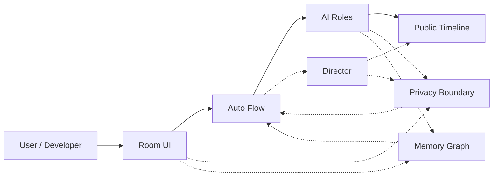
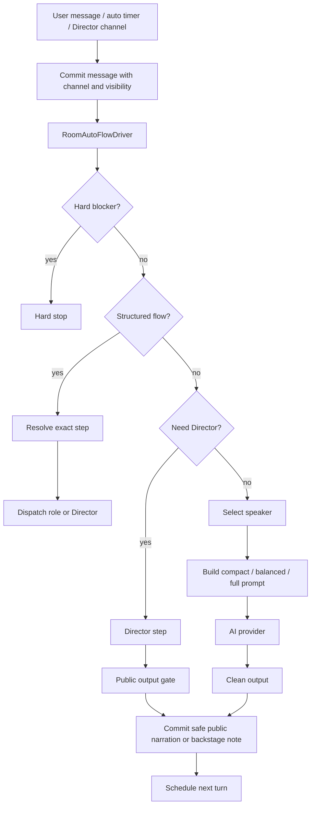
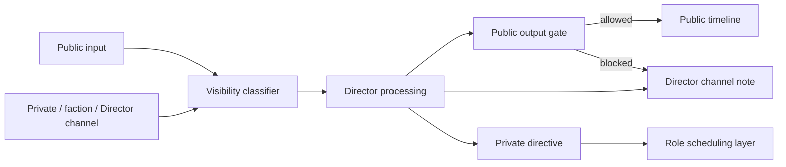
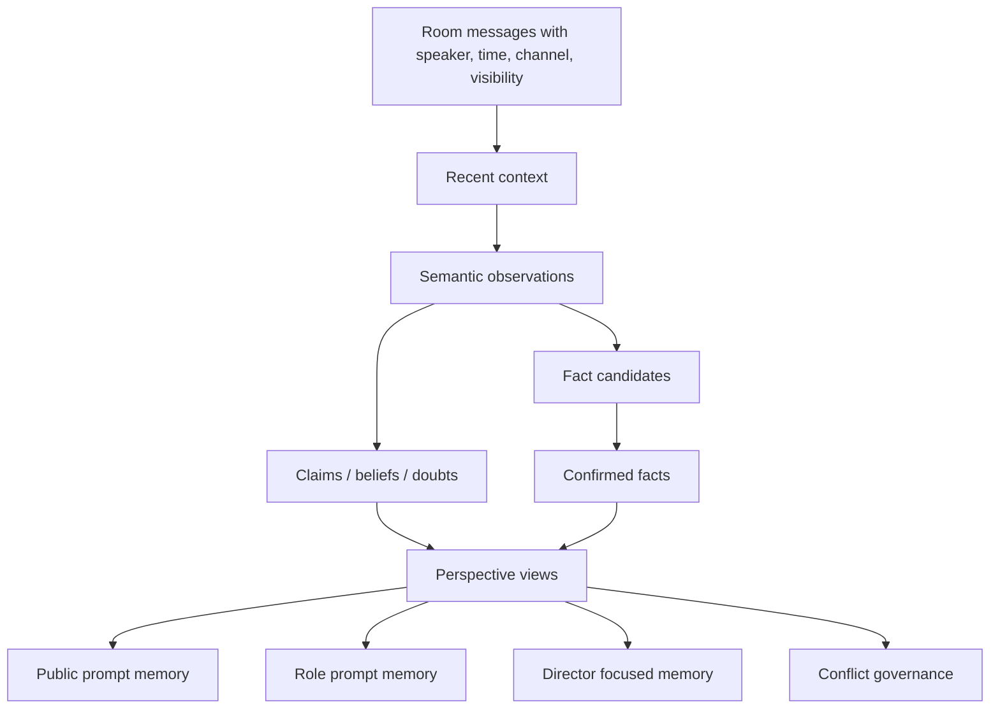

# CastRoom AI Architecture

This page describes the runtime shape of CastRoom AI.

## 1. Main Runtime Path

Normal chat follows the short path from Room UI to Auto Flow to AI Roles. Director intervention is reserved for narration, rulings, stage changes, recovery, and visibility-sensitive decisions.

## 2. Room Flow

`continuous` should keep moving unless there is a real hard blocker such as a provider failure, no runnable role, a privacy block, or a manual pause. `fill_gap` fills one missing beat and then observes. `wait_for_instruction` waits for the user.

## 3. Director Boundary

Director can know more than ordinary roles, but public output is checked before it reaches the main timeline. Backstage notes, private directives, private chats, and faction information must not be injected into ordinary public prompts.

## 4. Memory Graph

Memory is not a flat transcript. CastRoom AI separates context, semantic observations, claims, beliefs, conflicts, and confirmed facts. Conflict governance should show which source sentence conflicts with which other source sentence.
