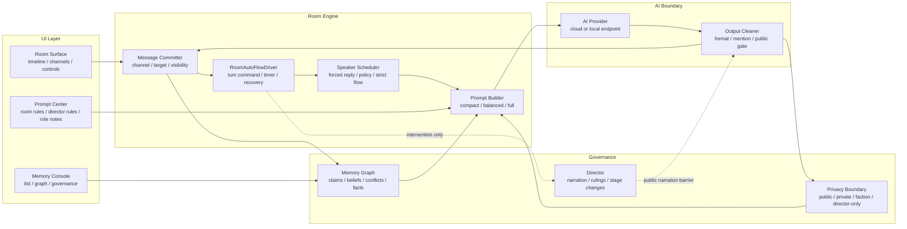
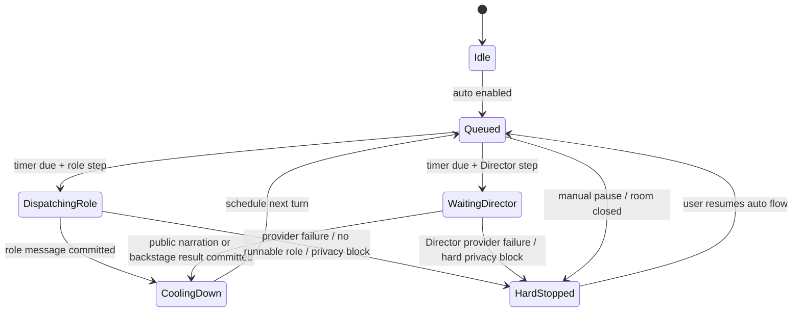
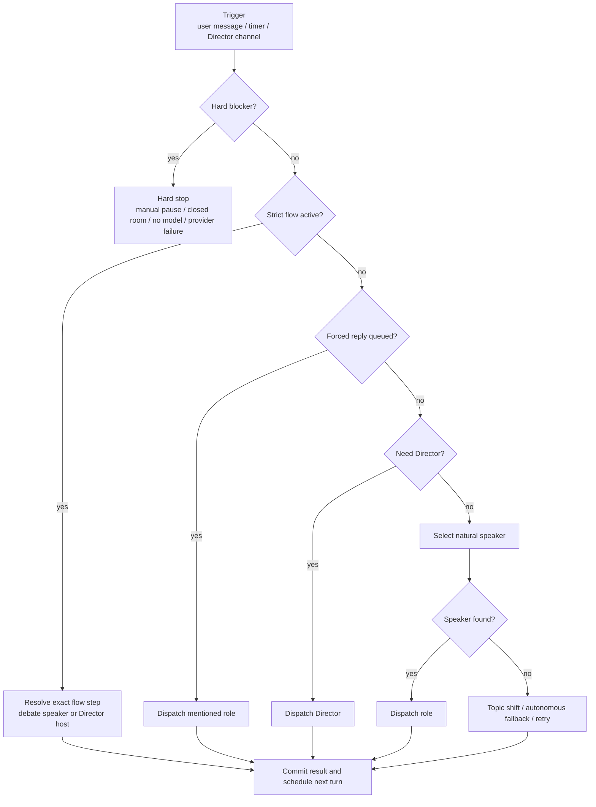
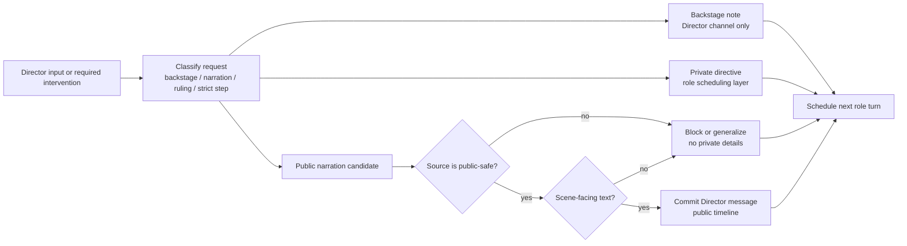
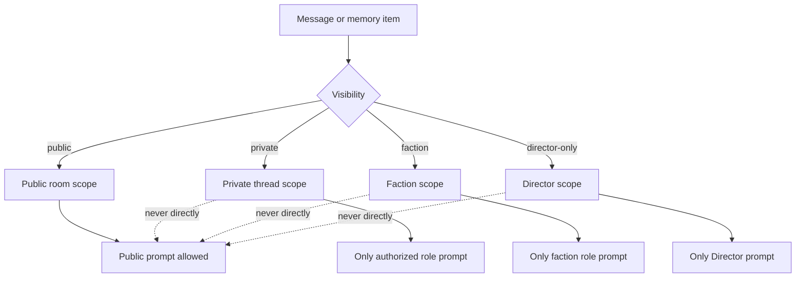
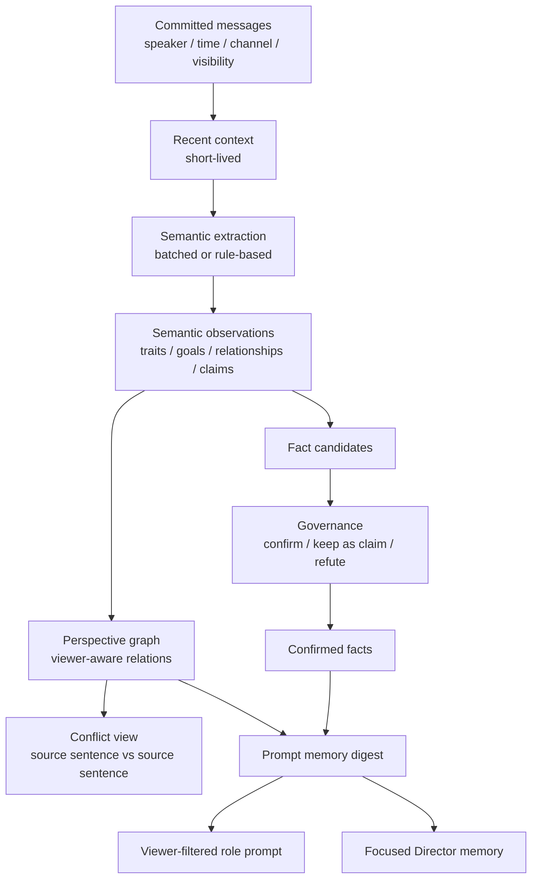
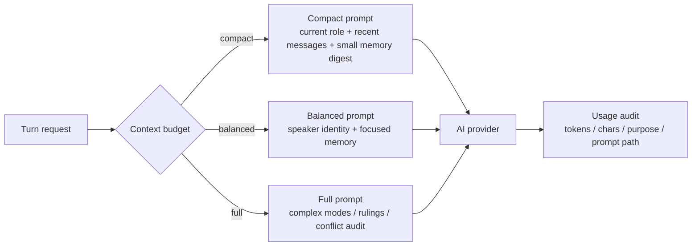

# CastRoom AI Developer Architecture

This document is the developer-facing architecture overview for CastRoom AI. It focuses on the runtime paths that matter when debugging room flow, Director behavior, privacy boundaries, memory graph behavior, and token cost.

## 1. Runtime Map

The normal path is short: room message, flow driver, speaker selection, prompt, provider, cleaned output, timeline. Director, memory graph, and privacy checks are side paths that should be entered only when they add structure, safety, or durable context.

## 2. Automatic Room Flow

Flow policy:

- `wait_for_instruction` may wait for user input.
- `fill_gap` fills one missing beat and then observes.
- `continuous` must not wait for the user. Soft blockers become role fallback, topic shift, Director step, or retry.
- `waiting_director` is allowed in `continuous`; `waiting_user` is not.

## 3. Turn Dispatch Pipeline

Priority order is fixed: hard blockers, strict structured flow, forced replies, Director intervention, natural role turn, topic shift, retry. Speaker policy must not override strict debate flow or a one-shot public role mention.

## 4. Director and Public Narration Boundary

Public Director text is a room event. It must be committed before roles react to it. Backstage notes do not block role turns and must not enter public timeline, public memory, or ordinary role prompts.

## 5. Visibility Boundary

Public role mentions are visible scheduling hints, not private chat. Director mentions route to the Director channel. AI role output must not create new scheduling mentions.

## 6. Memory and Perspective Graph

The graph does not treat raw chat as fact. It separates `claimed`, `believed`, `doubted`, `confirmed`, `disputed`, and `refuted`. Conflict governance should show both source sentences, their speakers, timestamps, visibility, confidence, and the conflict reason.

## 7. Prompt and Token Budget

Default casual room turns should prefer compact speaker prompts and local scheduling. Full Director or planner prompts are reserved for rulings, privacy risk, strict stage changes, conflict governance, or complex story flow.
