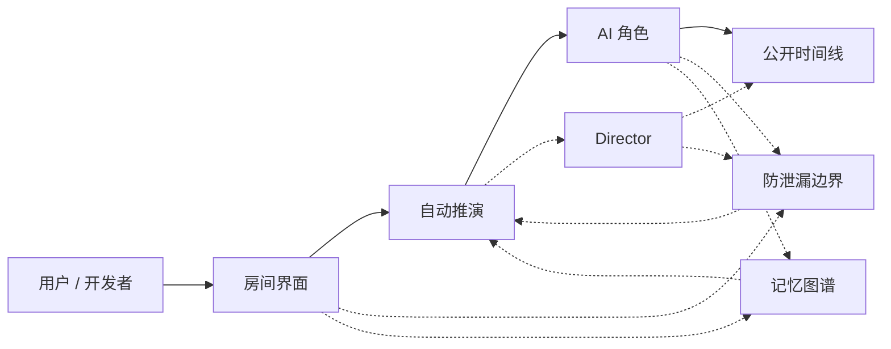
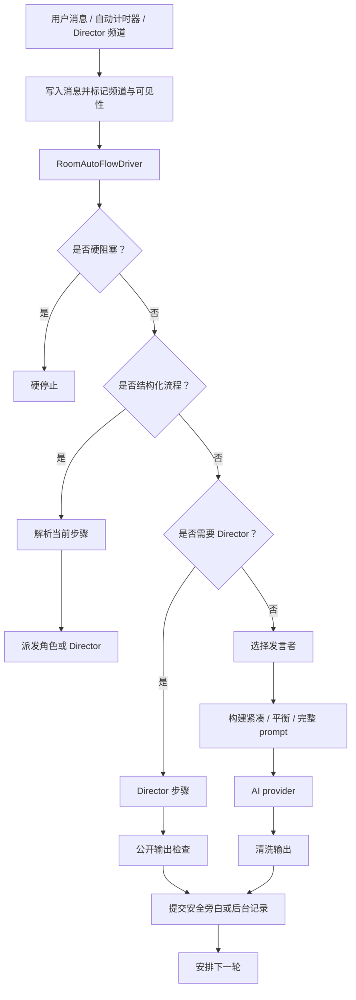
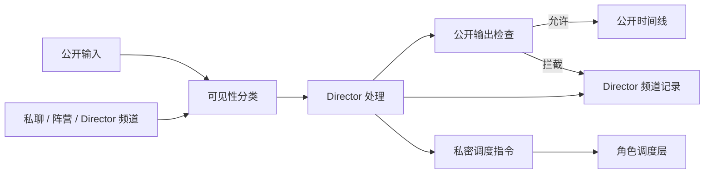
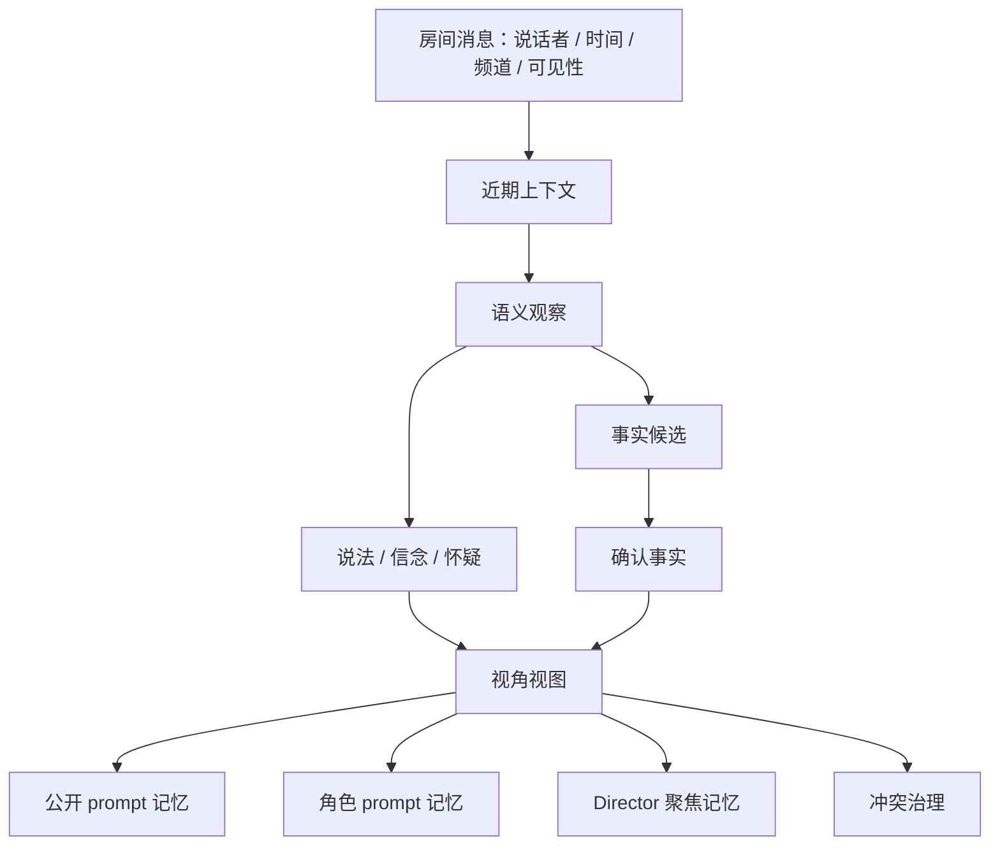

# CastRoom AI 架构

本文说明 CastRoom AI 的运行结构。

## 1. 主运行链路

普通聊天走短路径：房间界面进入自动推演，再由 AI 角色自然接话。Director 只在需要旁白、裁定、阶段切换、防卡住或可见性判断时介入。

## 2. 房间自动推演

`continuous` 除真实硬阻塞外应持续推进。硬阻塞包括 provider 失败、没有可运行角色、隐私硬拦截或用户手动暂停。`fill_gap` 只补一拍，然后观察。`wait_for_instruction` 才等待用户。

## 3. Director 边界

Director 可以知道比普通角色更多的信息，但任何公开输出都必须先通过检查。后台记录、私密调度、私聊和阵营信息不能注入普通公开 prompt。

## 4. 记忆图谱

记忆不是扁平聊天记录。CastRoom AI 会区分上下文、语义观察、说法、信念、冲突和确认事实。冲突治理需要显示“哪一句”和“哪一句”发生了冲突。
