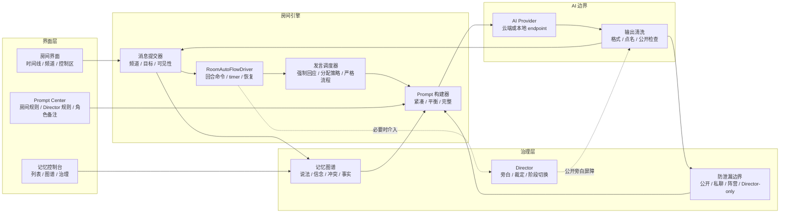
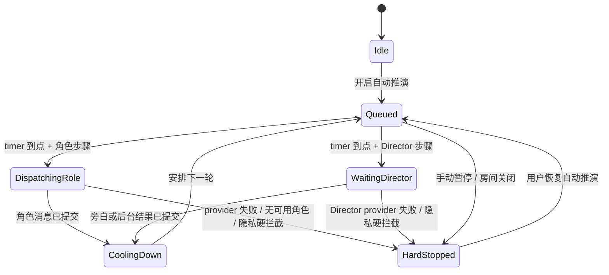
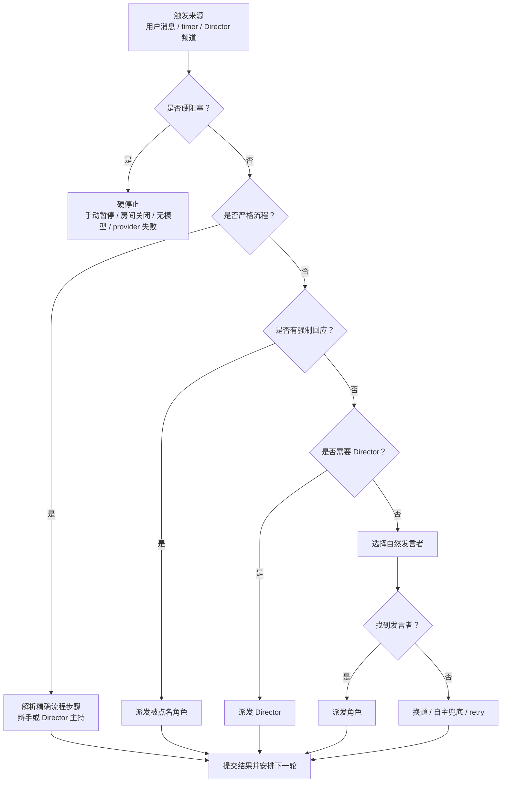
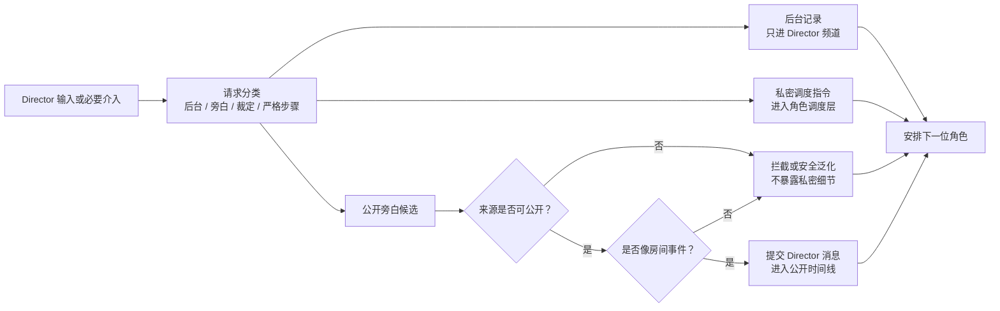
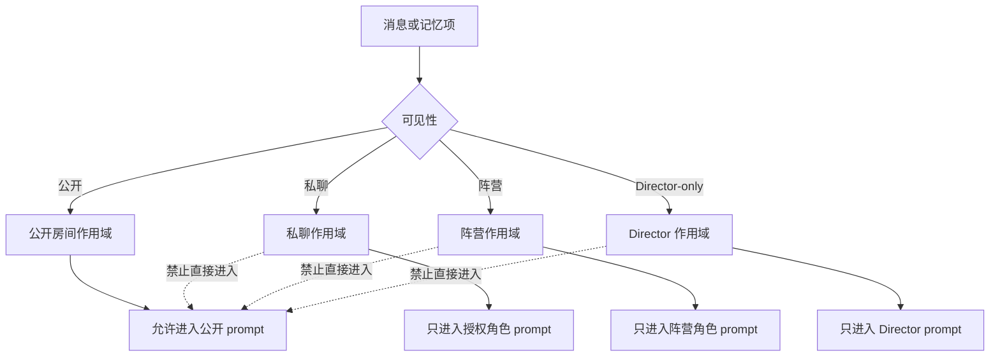
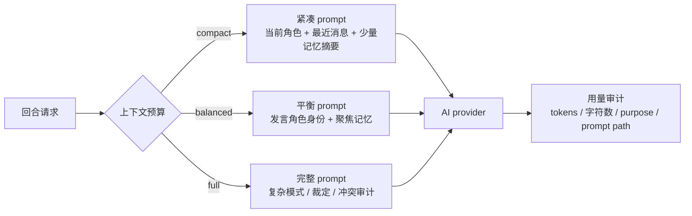

# CastRoom AI 开发者架构

本文是面向开发者的 CastRoom AI 架构说明，重点解释房间自动推进、Director 行为、防泄漏边界、记忆图谱和 token 成本相关的运行链路。

## 1. 运行总览



普通聊天的主路径应该很短：消息进入房间，自动推演决定下一轮，调度角色，构建 prompt，调用 provider，清洗输出，再写回时间线。Director、记忆图谱和防泄漏检查是旁路能力，只在需要结构、安全或长期上下文时介入。

## 2. 自动推演状态机



推进策略固定为：

- `wait_for_instruction` 可以等待用户。
- `fill_gap` 只补一拍，然后观察。
- `continuous` 不能等待用户；软阻塞要转成换角色、换话题、Director 步骤或 retry。
- `continuous` 可以等 Director 完成内部步骤，但不能进入 `waiting_user`。

## 3. 回合派发链路



派发优先级固定为：硬阻塞、严格结构化流程、用户公开点名的强制回应、Director 必要介入、自然角色发言、换题或 retry。发言分配策略不能覆盖严格辩论流程，也不能覆盖一次性公开点名。

## 4. Director 与公开旁白边界



Director 的公开文本是房间事件，必须先落地到公开时间线，角色才能回应。后台记录不会阻塞角色，也不能进入公开时间线、公开记忆或普通角色 prompt。

## 5. 可见性边界



公开点名只是公开调度提示，不是私聊。Director 点名会进入 Director 频道。AI 角色输出不能创造新的调度点名。

## 6. 记忆与多视角图谱

```mermaid
flowchart TD
  timeline["已提交消息<br/>说话者 / 时间 / 频道 / 可见性"] --> context["近期上下文<br/>短期使用"]
  context --> extractor["语义提取<br/>批量或规则驱动"]
  extractor --> observations["语义观察<br/>倾向 / 目标 / 关系 / 说法"]
  observations --> graph["多视角图谱<br/>按 viewer 查询关系"]
  observations --> candidates["事实候选"]
  candidates --> governance["记忆治理<br/>确认 / 保留为说法 / 反驳"]
  governance --> facts["确认事实"]
  graph --> conflicts["冲突视图<br/>源句对源句"]
  facts --> promptMemory["Prompt 记忆摘要"]
  graph --> promptMemory
  promptMemory --> rolePrompt["按视角过滤的角色 prompt"]
  promptMemory --> directorPrompt["Director 聚焦记忆"]
```

图谱不把原始聊天直接当事实。它区分 `claimed`、`believed`、`doubted`、`confirmed`、`disputed` 和 `refuted`。冲突治理应显示两边源句、说话者、时间、可见性、置信度和冲突原因。

## 7. Prompt 与 token 预算



默认日常房间应优先使用本地调度和紧凑角色 prompt。完整 Director 或 planner prompt 只用于裁定、隐私风险、严格阶段切换、冲突治理或复杂剧情推进。
