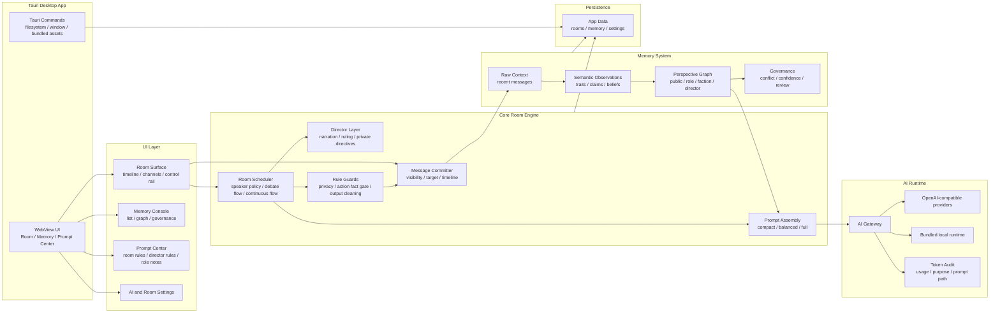
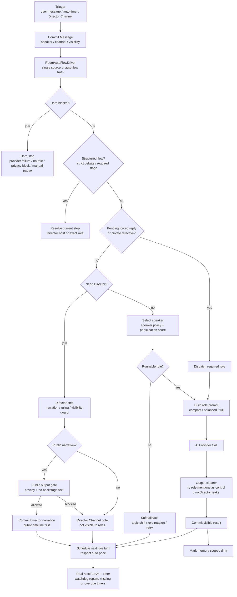
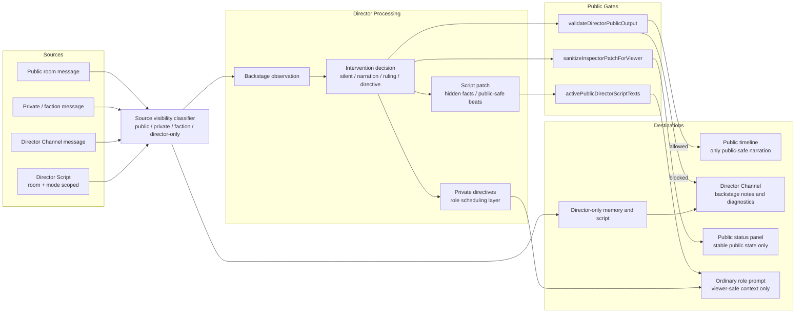
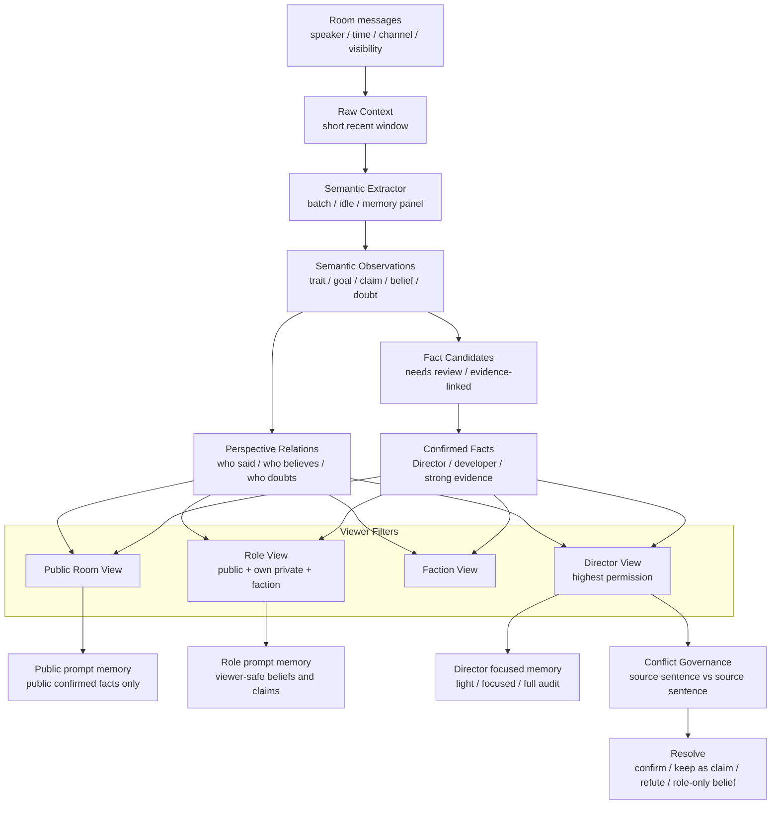

# CastRoom AI Architecture

This page contains the high-level architecture diagrams for CastRoom AI. The diagrams are written in Mermaid so GitHub can render them directly.

这份文档记录 CastRoom AI 的核心架构。图用 Mermaid 编写，GitHub 可以直接渲染。

## 1. System Overview

CastRoom AI is a Tauri desktop app. The web UI renders the room, memory console, prompt center, and configuration panels. The core engine decides room turns, protects visibility boundaries, builds prompts, calls AI providers, and persists room-scoped state.

## 2. Room Turn Pipeline

A room turn is not a direct “send message to all models” loop. The scheduler first decides whether the room needs a role reply, Director intervention, a retry, or a hard stop. In normal casual chat, the path should be short: local scheduling plus a compact speaker prompt.

## 3. Director Boundaries

The Director can observe more than ordinary roles, but public output is tightly gated. Backstage scheduling and private information must not leak into the main channel, public status panel, public graph, or ordinary role prompts.

## 4. Memory and Perspective Graph

The memory system separates recent context, semantic observations, claims, beliefs, and confirmed facts. The graph is a perspective graph: it shows what the public room, a role, a faction, or the Director can see and believe.

